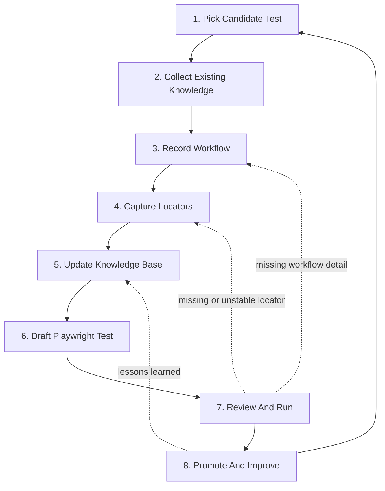

# QE Engineer Playwright Migration and AI Knowledge Base Plan

## Purpose

This plan is for a QE engineer migrating one test at a time from Selenium or qTest knowledge into Playwright automation, while also improving an AI-ready knowledge base.

The goal is simple:

- Understand the test.
- Record the workflow.
- Capture the locators.
- Update the knowledge base.
- Draft the Playwright test.
- Review and run it.
- Promote it when stable.
- Feed lessons learned back into the next test.

## Process Diagram

## Stage 1: Pick Candidate Test

### Goal

Choose one test that is worth migrating and realistic to finish.

### QE Tasks

1. Select one qTest case or Selenium test.
2. Prefer smoke, login, navigation, create, edit, save, or approval flows.
3. Avoid tests that are already flaky or not understood.
4. Confirm the expected result is clear.
5. Mark the test as ready, blocked, or needs information.

### Output

A selected test with priority, readiness status, and known blockers.

## Stage 2: Collect Existing Knowledge

### Goal

Gather everything useful before creating the Playwright test.

### QE Tasks

1. Find the qTest case.
2. Find the Selenium test, if it exists.
3. Find any existing Playwright draft, if it exists.
4. Find screenshots, recordings, notes, or manual steps.
5. Confirm test data and preconditions.
6. Save useful notes in Markdown.

### Output

A simple knowledge packet for the selected test.

## Stage 3: Record Workflow

### Goal

Capture the real user workflow in plain language.

### QE Tasks

1. Perform the workflow or observe it being performed.
2. Record the main actions in order.
3. Capture page names, field names, buttons, and expected results.
4. Note user role, preconditions, and test data.
5. Save the workflow as Markdown.

### Output

A clear workflow document for the selected test.

## Stage 4: Capture Locators

### Goal

Prepare reliable locators before using them in Playwright.

### QE Tasks

1. Open each page used by the workflow.
2. Capture locators for required fields, buttons, links, tables, and messages.
3. Prefer role, label, text, or test ID locators.
4. Mark each locator as approved, needs review, unstable, or missing.
5. Recheck missing or unstable locators before automation.

### Output

A reviewed locator list for the workflow.

## Stage 5: Update Knowledge Base

### Goal

Keep the AI knowledge base accurate enough to help with future tests.

### QE Tasks

1. Add qTest notes.
2. Add workflow notes.
3. Add locator notes.
4. Add page or module notes if needed.
5. Link the test case, workflow, locators, and business rules.
6. Clearly mark missing information.

### Output

An updated knowledge base entry for the selected workflow.

## Stage 6: Draft Playwright Test

### Goal

Create a first Playwright draft from the knowledge base.

### QE Tasks

1. Use the qTest case as the business intent.
2. Use the workflow file as the step sequence.
3. Use approved locators first.
4. Reuse Selenium logic only if it still matches the current workflow.
5. Add assertions for the expected business result.
6. Mark missing locators, missing data, or unclear rules for follow-up.

### Output

A Playwright test draft or AI-assisted skeleton ready for review.

## Stage 7: Review And Run

### Goal

Make sure the test is correct and stable before promotion.

### QE Tasks

1. Compare the test against the qTest case and workflow notes.
2. Review locators, waits, assertions, and test data.
3. Run the test locally.
4. Fix workflow, locator, data, or assertion issues.
5. Re-run until the result is stable.
6. Update the knowledge base with what changed.

### Output

A locally passing Playwright test with updated knowledge notes.

## Stage 8: Promote And Improve

### Goal

Move the test into the normal review and CI path, then use what was learned to improve the next migration.

### QE Tasks

1. Submit the test for review.
2. Confirm the test maps to a qTest case or workflow ID.
3. Confirm locators are approved or clearly marked.
4. Confirm assertions validate the business outcome.
5. Run or request CI execution.
6. Promote stable tests into smoke or regression.
7. Track flaky behavior, missing locators, and knowledge gaps.
8. Feed lessons learned back into the knowledge base.

### Output

A promoted Playwright test and a better knowledge base for the next migration.

## QE Checklist

Use this checklist before considering a test ready:

- Test intent is clear.
- Preconditions are known.
- Test data is known.
- Workflow steps are documented.
- Expected result is documented.
- Required locators are captured.
- Unstable locators are marked.
- Assertions validate the business outcome.
- The test runs locally.
- CI status is known.
- The knowledge base is updated.

## Recommended Starting Order

Start with these test types:

1. Login smoke test.
2. Home page navigation.
3. Create record.
4. Edit and save record.
5. Approval workflow.
6. Access or permission check.
7. Search or filter workflow.
8. End-to-end regression candidate.

Avoid starting with tests that are flaky, depend on complex external setup, have many missing locators, or are not clearly understood.

## Summary

The QE engineer should run this as a repeatable 8-stage loop. Each migrated test should improve both the Playwright suite and the knowledge base. The better the knowledge base becomes, the more useful AI becomes for the next migration.
